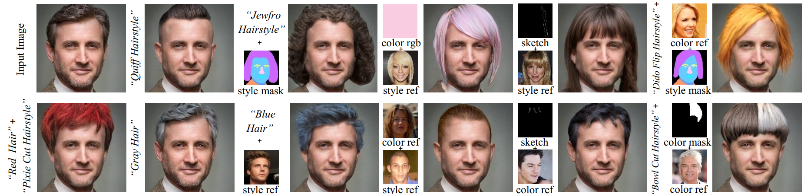

# HairCLIPv2: Unifying Hair Editing via Proxy Feature Blending (ICCV2023)
<a href="https://openaccess.thecvf.com/content/ICCV2023/papers/Wei_HairCLIPv2_Unifying_Hair_Editing_via_Proxy_Feature_Blending_ICCV_2023_paper.pdf"></a>

> This repository hosts the official PyTorch implementation of the paper: "**HairCLIPv2: Unifying Hair Editing via Proxy Feature Blending**".

HairCLIPv2 supports hairstyle and color editing individually or jointly with **unprecedented user interaction mode support**, including text, mask, sketch, reference image, etc.



Tianyi Wei<sup>1</sup>,
Dongdong Chen<sup>2</sup>,
Wenbo Zhou<sup>1</sup>,
Jing Liao<sup>3</sup>,
Weiming Zhang<sup>1</sup>,
Gang Hua<sup>4</sup>, 
Nenghai Yu<sup>1</sup> <br>
<sup>1</sup>University of Science and Technology of China, <sup>2</sup>Microsoft Cloud AI, <sup>3</sup>City University of Hong Kong, <sup>4</sup>Xi'an Jiaotong University

## News
**`2023.12.08`**: The initial version of the code is released.   
**`2023.10.12`**: [HairCLIPv2](https://github.com/wty-ustc/HairCLIPv2) is accepted by ICCV2023! 🎉

## Getting Started
### Prerequisites
```bash
$ pip install torch==1.9.0+cu111 torchvision==0.10.0+cu111 -f https://download.pytorch.org/whl/torch_stable.html
$ pip install ftfy regex tqdm matplotlib jupyter ipykernel opencv-python scikit-image kornia==0.6.7 face-alignment==1.3.5 dlib==19.22.1
$ pip install git+https://github.com/openai/CLIP.git
```
### Pretrained Models
Download and put all the downloaded pretrained weights into the `pretrained_models` directory.
| Path | Description
| :--- | :----------
|[FFHQ StyleGAN](https://drive.google.com/file/d/1g8S81ZybmrF86OjvjLYJzx-wx83ZOiIw/view?usp=drive_link) | StyleGAN model pretrained on FFHQ with 1024x1024 output resolution.
|[Face Parse Model](https://drive.google.com/file/d/1OG6t7q4PpHOoYNdP-ipoxuqYbfMSgPta/view?usp=drive_link) | Pretrained face parse model taken from [Barbershop](https://github.com/ZPdesu/Barbershop/).
|[Face Landmark Model](https://drive.google.com/file/d/1c-SgUUQj0X1mIl-W-_2sMboI2QS7GzfK/view?usp=drive_link) | Used to align unprocessed images.
|[Bald Proxy](https://drive.google.com/file/d/1sa732uBfX1739MFsvtRCKWCN54zYyltC/view?usp=drive_link) | Bald proxy weights from [HairMapper](https://github.com/oneThousand1000/HairMapper). 
|[Sketch Proxy](https://drive.google.com/file/d/1qk0ZIfA1VmrFUzDJ0g8mK8nx0WtF-5sY/view?usp=drive_link) | Sketch proxy weights trained on [hair-sketch dataset](https://github.com/chufengxiao/SketchHairSalon#Dataset) using [E2style](https://github.com/wty-ustc/e2style).
### Input Instructions
All inputs are in the `test_images` folder and all images should be made sure to be aligned to 1024x1024 according to FFHQ standards.
| Path | Description
| :--- | :----------
|`unaligned_img` | Natural images that should be aligned using `python scripts/align_face.py` Results are stored in `aligned_img`. 
|`aligned_img` | Depending on the usage, they should be moved to `src_img` or `ref_img`.
|`src_img` | Aligned image to be edited.
|`src_F` | The latent code of `src_img` being inverted is not required to be provided by the user.
|`ref_img` | Aligned hairstyle reference image, hair color reference image.
|`ref_latent` | The latent code of `ref_img` being inverted is not required to be provided by the user.
### Enjoy
Open `hairclip_v2_demo.ipynb` to unlock your versatile hairstyles! 

If you run it on a remote server, you need to run `jupyter notebook --port=20367 --allow-root --ip=0.0.0.0` first. then use e.g. VS Code to select that Jupyter Server as your kernel.
## To Do
- [ ] Develop an interactive interface

## Acknowledgements
This code is based on [Barbershop](https://github.com/ZPdesu/Barbershop/).

## Citation

If you find our work useful for your research, please consider citing the following papers :)

```
@article{wei2023hairclipv2,
  title={HairCLIPv2: Unifying Hair Editing via Proxy Feature Blending},
  author={Wei, Tianyi and Chen, Dongdong and Zhou, Wenbo and Liao, Jing and Zhang, Weiming and Hua, Gang and Yu, Nenghai},
  journal={Proceedings of the IEEE/CVF International Conference on Computer Vision},
  year={2023}
}
```

```
@article{wei2022hairclip,
  title={Hairclip: Design your hair by text and reference image},
  author={Wei, Tianyi and Chen, Dongdong and Zhou, Wenbo and Liao, Jing and Tan, Zhentao and Yuan, Lu and Zhang, Weiming and Yu, Nenghai},
  journal={Proceedings of the IEEE/CVF Conference on Computer Vision and Pattern Recognition},
  year={2022}
}
```
